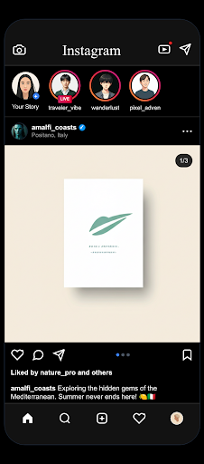
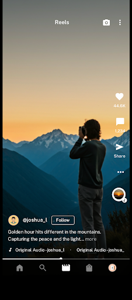
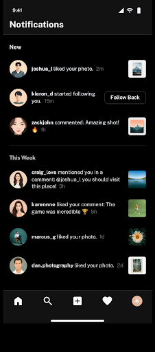
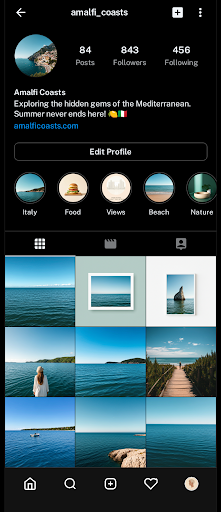
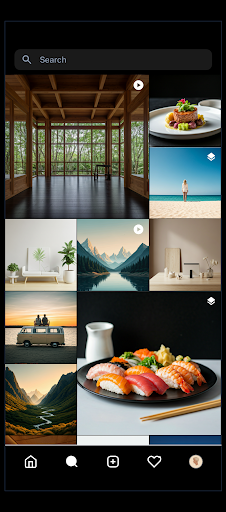
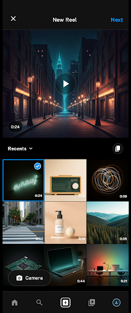

# 📸 Flutter Instagram Clone

A feature-rich Instagram clone built with Flutter, focused on premium UI/UX, smooth performance, and state-of-the-art animations.

## 📱 Screenshots

| Home Feed | Reels | Notifications |
| :---: | :---: | :---: |
|  |  |  |
| **Profile** | **Search** | **Upload Reel** |
|  |  |  |

## 🎬 Demo Video

[Click here to watch the Project Demo Video](docs/demo_video.mp4)

---

*   ✨ **Shimmer Loading**: Beautiful skeletons for data fetching states.
*   🔄 **Infinite Scroll**: Seamlessly loading content as you scroll down.
*   🔍 **Pinch to Zoom**: High-fidelity image zooming with spring-back animation.
*   ❤️ **Like/Save Toggle**: Instant UI updates for interactive post actions.

## 🚀 How to Run

### Prerequisites
*   [Flutter SDK](https://docs.flutter.dev/get-started/install) (latest stable version)
*   [Android Studio](https://developer.android.com/studio) or [VS Code](https://code.visualstudio.com/)
*   Git

### Execution Steps

1.  **Clone the repository**
    ```bash
    git clone https://github.com/yourusername/instagram_flutter_app_clone.git
    ```

2.  **Navigate to the project directory**
    ```bash
    cd instagram_flutter_app_clone
    ```

3.  **Install dependencies**
    ```bash
    flutter pub get
    ```

4.  **Run the application**
    ```bash
    flutter run
    ```

5.  **Build Release APK**
    ```bash
    flutter build apk --release
    ```

## 🧠 State Management

Riverpod was chosen as the primary state management solution for this project due to its robustness and flexibility.

*   ✅ **Compile-time Safety**: It catches provider-related errors during development rather than at runtime.
*   ✅ **Enhanced Testability**: Providers can be easily overridden, making unit and widget testing straightforward.
*   ✅ **Universal Access**: State can be accessed from anywhere without being strictly bound to the widget tree's context.
*   ✅ **Performance Optimized**: Only the specific widgets listening to a state slice are rebuilt, ensuring 60 FPS performance.
*   ✅ **Auto-Dispose**: Automatically cleans up state when it's no longer needed, preventing memory leaks in complex screens.

## 🏗️ Architecture

```text
lib/
├── core/                # Core configurations and app settings (Colors, Typography, Themes)
├── models/              # Data structures and domain entities (Post, User, Story)
├── providers/           # Riverpod state providers and business logic
├── screens/             # Main application pages and screen layouts
├── services/            # Repositories and data fetching services
├── widgets/             # Reusable UI components (PostCard, StoriesTray, etc.)
└── main.dart            # Application entry point and provider setup
```

## ✨ Features Implemented

### 🏡 Core Feed
- [x] Instagram Home Screen UI
- [x] Stories Tray with animated borders
- [x] Post Carousel for multiple images
- [x] Infinite scrolling for feed posts

### 💬 Post Interactions
- [x] Double-tap to like functionality
- [x] Pinch-to-zoom on images (with spring-back)
- [x] Save and Bookmark toggle states
- [x] Interactive action buttons (Share, Comment)

### 🖥️ Screens
- [x] Explore Screen with staggered grid layout
- [x] Full Reels viewer with vertical swipe
- [x] Notifications screen with section headers
- [x] Complete Profile screen with tabs and highlights

### 🛠️ Technical
- [x] Dark Mode support (Material 3)
- [x] Shimmer loading effects for all lists
- [x] Clean architecture and separation of concerns
- [x] Responsive layout for different screen sizes

## 📦 Packages Used

| Package | Version | Purpose |
| :--- | :--- | :--- |
| `flutter_riverpod` | `^3.3.1` | Robust state management and DI |
| `cached_network_image` | `^3.4.1` | Efficient image caching and loading |
| `shimmer` | `^3.0.0` | Loading skeleton animations |
| `google_fonts` | `^8.0.2` | High-quality typography (Inter, etc.) |
| `flutter_svg` | `^2.2.4` | Rendering high-definition vector icons |

## 📝 Assignment Requirements Checklist

| Requirement | Status |
| :--- | :---: |
| Implementation of Home Feed with Stories | ✔️ |
| Reels Screen with Vertical Swiping | ✔️ |
| Explore Screen with Staggered Grid | ✔️ |
| Profile Screen with Tab Navigation | ✔️ |
| Infinite Scrolling Implementation | ✔️ |
| State Management using Provider/Riverpod | ✔️ |
| Proper Folder Architecture | ✔️ |
| Error Handling and Loading States (Shimmer) | ✔️ |
| APK Build Readiness | ✔️ |

---
*Created for the Flutter App Development Assignment* 🚀
